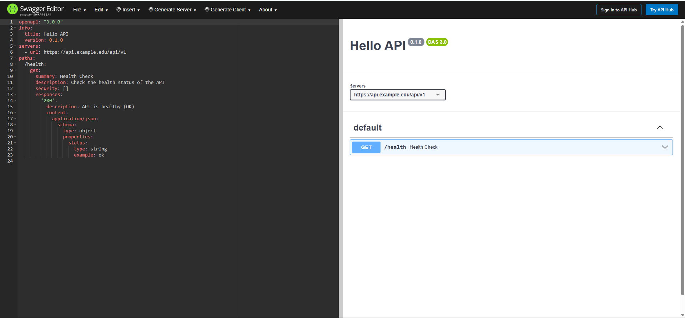
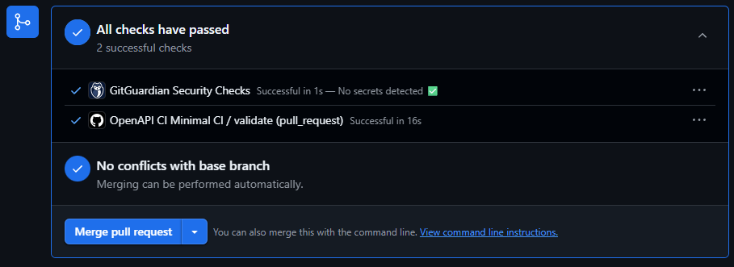
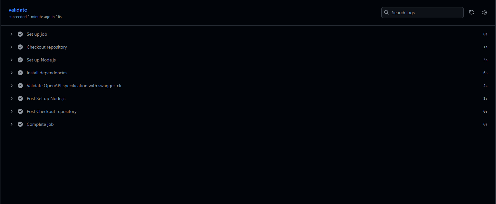

# Lab 1 Submission

## Repository Link

[WSSE Student Enrollment Labs 2025](https://github.com/Unforgettableeternalproject/wsse-student-enrollment-labs-2025)

## Pull Request Link

[PR #1: Lab 1 Implementation](https://github.com/Unforgettableeternalproject/wsse-student-enrollment-labs-2025/pull/1)

## Screenshots

### Swagger Editor Screenshot



### PR Green Light Screenshot



### CI Content Screenshot



## Key Snippets from openapi.yaml

### Health Check Endpoint

```yaml
paths:
  /health:
    get:
      summary: "Health Check"
      description: "Check the health status of the API"
      security: []  # No authentication required (currently)
      responses:
        '200':
          description: "API is healthy (OK)"
          content:
            application/json:
              schema:
                type: object
                properties:
                  status:
                    type: string
                    example: "ok"
```

### GET /students Endpoint

```yaml
  /students:
    get:
      summary: "Get all students"
      description: "Retrieve a list of all students"
      responses:
        '200':
          description: "List of students"
          content:
            application/json:
              schema:
                type: array
                items:
                  $ref: '#/components/schemas/Student'
```

### POST /students Endpoint

```yaml
    post:
      summary: "Create a new student"
      description: "Add a new student to the system"
      requestBody:
        required: true
        content:
          application/json:
            schema:
              $ref: '#/components/schemas/Student'
      responses:
        '201':
          description: "Student created successfully"
          content:
            application/json:
              schema:
                $ref: '#/components/schemas/Student'
```

### Schemas

#### Student Schema

```yaml
components:
  schemas:
    Student:
      type: object
      properties:
        id:
          type: integer
          example: 1
        name:
          type: string
          example: "John Doe"
        email:
          type: string
          example: "john.doe@example.com"
      required:
        - name
        - email
```

#### Course Schema

```yaml
    Course:
      type: object
      properties:
        id:
          type: integer
          example: 101
        title:
          type: string
          example: "Introduction to Computer Science"
        credits:
          type: integer
          example: 3
      required:
        - title
        - credits
```